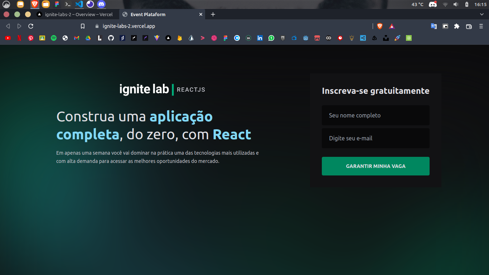
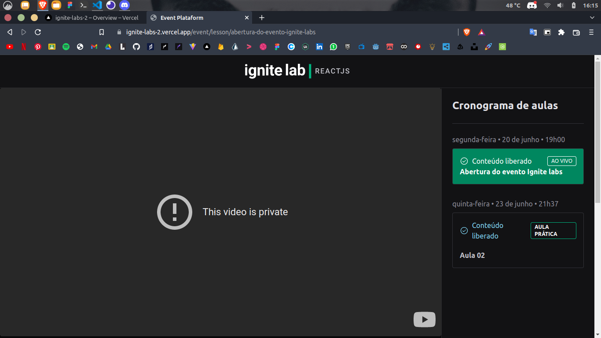
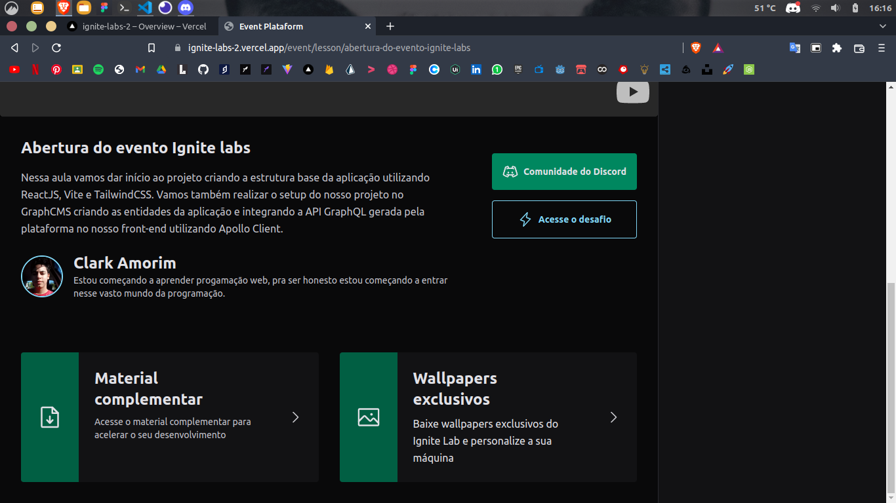
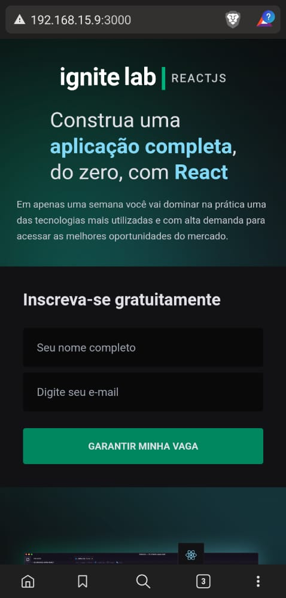
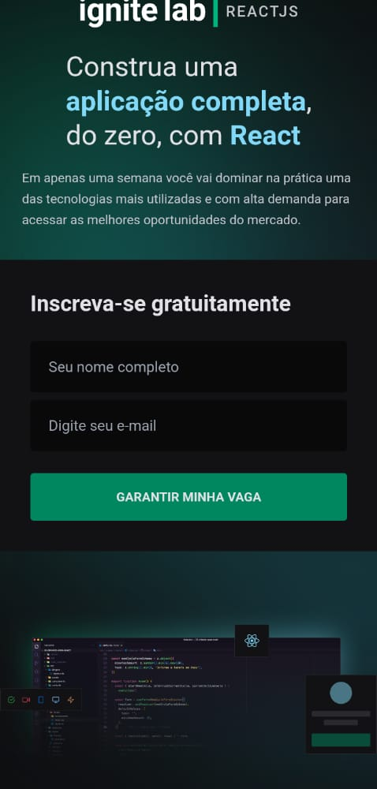
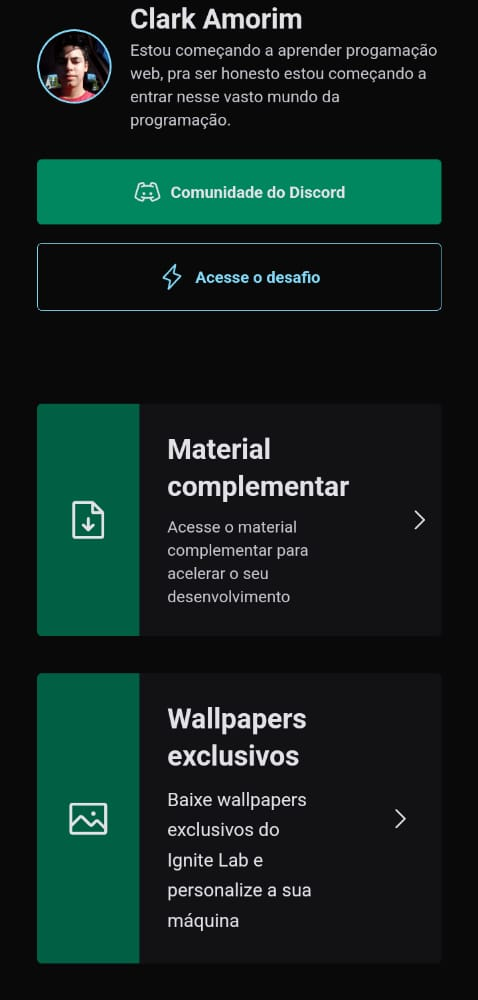
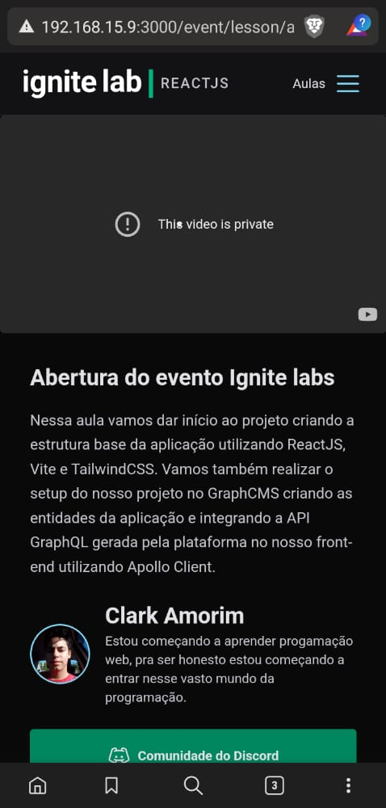

## Desafios

- [X] Criar uma variante do botão(criando um component) que muda por meio de props o seu  estilo (Video)
- [x] Deixar a aplicação responsiva(mobile)
- [x] Criar uma página seletora de aulas no **<Event />**
- [] Criar uma forma de login com o github, e salvar elas em localstorage/cookies

<--------------------------------------------------------------------------------------------->

<h2> Projeto feito na semana do Ignite Labs 2 da <a link="https://github.com/rocketseat-education">Rocketseat</a></h2>

Feito com as tecnologias Tailwindcss, ReactJS, TypeScript, GraphCMS, GraphQL Apollo, Vime. Design responsivo.

Desktop

 

Mobile

<--------------------------------------------------------------------------------------------->

<--------------------------------------------------------------------------------------------->

<--------------------------------------------------------------------------------------------->
